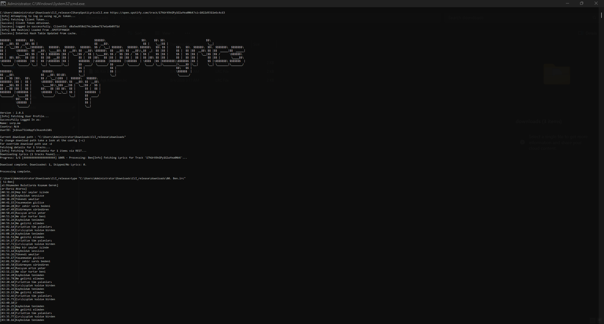
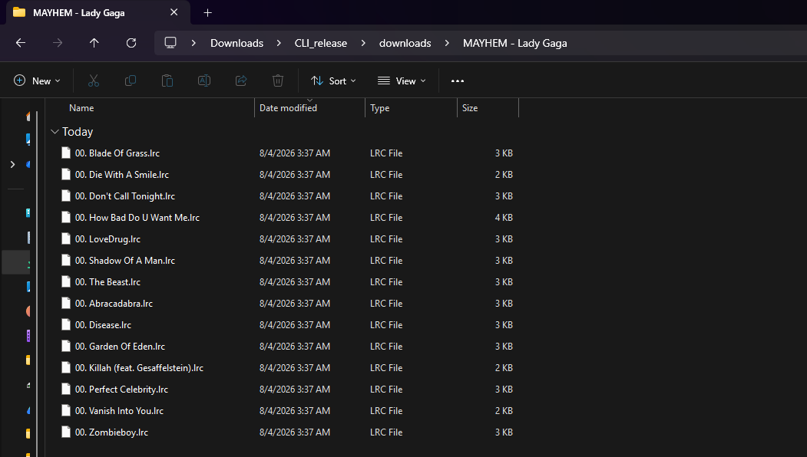
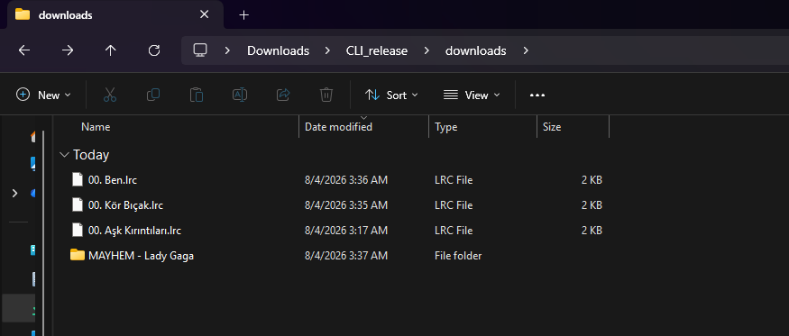
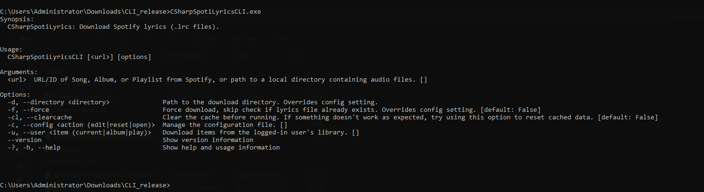

$$\large\color{green}\textbf{**Status Update (29/08/2026):** Version 2.0.1 AND 2.0.2 Release is WORKING!}$$

[](https://dotnet.microsoft.com/)
[](https://dotnet.microsoft.com/download)
[](https://github.com/s0rp/CSharpSpotiLyrics/releases)
[](LICENSE)
[]()

### See it live: [https://sxrp.me](https://sxrp.me)

# CSharpSpotiLyrics
> **The ultimate command-line Spotify synced lyrics downloader (`.lrc`) built in C# and .NET.**

**CSharpSpotiLyrics** is a professional C# command-line interface (CLI) application designed to retrieve, extract, and download synchronized time-coded lyrics (`.lrc` files) directly from Spotify.

Whether you need to batch-download lyrics for individual tracks, complete albums, public playlists, currently playing session tracks, or interactively select songs from your saved library, **CSharpSpotiLyrics** handles it seamlessly. It also features automatic local audio directory scanning to match ID3 metadata tags directly with Spotify's synced lyrics catalog.

---

## Preview & Screenshots

### Terminal Execution & LRC Output


### Downloaded LRC Files & Folder Structure



### CLI Options & Help Menu


---

## Sample Outputs (`Examples/` Directory)

You can inspect pre-downloaded synced `.lrc` file samples and album output structures directly inside the [`Examples/`](./Examples) directory in this repository.

---

### Alternative Languages (For README)
* [Türkçe (Turkish)](https://github.com/s0rp/CSharpSpotiLyrics/blob/main/README_TR.md)

---

> ⚠️ **Disclaimer**  
> **This project is intended for educational purposes only. Accessing Spotify's internal APIs might violate their Terms of Service. Use this tool responsibly and at your own risk. The developers assume no liability for account restrictions or consequences resulting from its use.**

---

## Features

*   **Multi-Target Lyrics Retrieval:** Download synced `.lrc` lyrics using Spotify Track, Album, or Playlist URLs and unique IDs.
*   **Local Audio Metadata Matching:** Scan local music folders, read audio file ID3 metadata tags, query Spotify automatically, and save synced `.lrc` files alongside your local media.
*   **Active Session Synchronization:** Instantly fetch and save lyrics for the song currently playing on your active Spotify session.
*   **Interactive Library Mode:** Interactively select and download lyrics from your saved library playlists and saved albums.
*   **Standardized LRC Formatting:** Outputs clean, time-synced `.lrc` files compatible with modern media players (e.g., VLC, Poweramp, Musicolet, Foobar2000).
*   **Zero-Config Browser Automation:** Built-in Playwright backend automatically bootstraps the required Chromium environment at runtime—no manual browser setup required.
*   **Flexible Configuration Management:** Dedicated `config.json` file to persist your default download directory and `sp_dc` cookie. All options can be overridden dynamically via command-line flags.
*   **Cache Management & Troubleshooting:** Easily flush state caches (TOTP keys and dynamic GraphQL hashes) with a simple CLI argument to resolve connection or API sync errors.

---

## Prerequisites

*   **.NET SDK:** .NET 6.0 SDK or later is required to build and run the source code. [Download .NET SDK](https://dotnet.microsoft.com/download).
*   **Spotify `sp_dc` Cookie:** A valid web player session cookie is required to authenticate API requests.

---

## Installation & Setup

1. **Clone the Repository:**
   ```bash
   git clone https://github.com/s0rp/CSharpSpotiLyrics
   cd CSharpSpotiLyrics/Cli
   ```

2. **Build the Application:**
   ```bash
   dotnet build -c Release
   ```

You can execute the utility directly via the .NET CLI or run the compiled binary under `/bin/Release/` directly.

---

## Configuration

Before downloading lyrics, you must authenticate the CLI by saving your Spotify `sp_dc` web cookie to the application profile.

### 1. How to retrieve your `sp_dc` cookie:
1. Open your web browser and log in to [open.spotify.com](https://open.spotify.com).
2. Open your browser's Developer Tools (typically `F12` or `Right Click -> Inspect`).
3. Navigate to the **Application** tab (Chrome/Edge) or **Storage** tab (Firefox).
4. Expand the **Cookies** dropdown on the left and select `https://open.spotify.com`.
5. Find the row named `sp_dc` and copy its alphanumeric **Value**.

> **Security Warning:** Your `sp_dc` token functions as your active session password. Keep it secure and never share it publicly.

### 2. Setting up the application config:
Run the built-in interactive configuration tool:
```bash
dotnet run -- --config edit
```
The interface will guide you to:
* Paste your copied `sp_dc` token.
* Specify your default target directory where lyric files should be saved.
* Set other structural preferences (e.g., `ForceDownload` behaviors).

*Note: The configuration directory varies based on your Operating System. The CLI will display the exact path of your `config.json` upon initialization.*

---

## Usage

```bash
# Using dotnet run
dotnet run -- [options] [<url_or_path>]

# Direct executable use (e.g., published binary)
./CSharpSpotiLyrics [options] [<url_or_path>]
```

### Arguments
*   `<url_or_path>`: *(Optional)* Accepts a Spotify track/album/playlist URL or ID, or a local file directory path.

### Options

| Command / Option | Description |
| :--- | :--- |
| `-d`, `--directory <path>` | Temporarily overrides the download output folder for this execution. |
| `-f`, `--force` | Forces download, overwriting existing `.lrc` files in the output directory. |
| `-cl`, `--clearcache` | Deletes cache configurations (`.SPOTIFYTOTP` and `.SPOTIFYHASH`) to resolve sync errors. |
| `-u`, `--user <item>` | Interacts with your active library. Values: `current`, `album`, `play`. |
| `-c`, `--config <action>` | Launches configuration helper. Values: `edit`, `reset`, `open`. |

---

## Command Examples

### Download via Spotify Link or ID
```bash
# Track URL
dotnet run -- "https://open.spotify.com/track/1DwscornXpj8fmOmYVlqZt"

# Album ID (URI Format)
dotnet run -- "spotify:album:7DIlfmw6CAE1J8tp2QqgAJ"

# Playlist Link (downloads all tracks inside)
dotnet run -- "https://open.spotify.com/playlist/1tlptlfM0epuPkqRbLHvdj"
```

### Local Library Matching
```bash
# Scan metadata in a local music folder and automatically download matching lyrics
dotnet run -- "/home/user/Music/MyAlbum"
```

### Active Session & Saved Library Interactions
```bash
# Download lyrics for whatever is playing on your account right now
dotnet run -- --user current

# Interactively browse and select saved playlists from your profile
dotnet run -- --user play

# Interactively browse and download saved albums from your profile
dotnet run -- --user album
```

### Configuration and Diagnostics
```bash
# Force overwrite existing lyrics files
dotnet run -- --force "https://open.spotify.com/track/1DwscornXpj8fmOmYVlqZt"

# Clear temporary API hashes and TOTP keys to resolve bad request errors
dotnet run -- --clearcache "https://open.spotify.com/track/1DwscornXpj8fmOmYVlqZt"

# Open the directory containing config.json in your File Explorer
dotnet run -- --config open
```

---

## Troubleshooting

If you encounter authentication or connection errors (e.g., `400 Bad Request` during client startup):
1. Ensure your `sp_dc` cookie hasn't expired. You can verify this by checking if you are still logged into the Spotify Web Player in your browser.
2. Run the application with the `-cl` / `--clearcache` option. This deletes local tokens and forces Playwright to renegotiate your connection structure and update your Pathfinder API hashes automatically.

---

## Credits

*   **Development & C# Core Architecture:** s0rp
*   **Workflow Rewriting & Code Arrangement:** Dixiz 3A (MoE Project Neural Supervisor)
